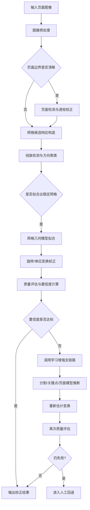

下面给出一份可直接作为项目内部设计稿初版使用的技术方案文档。为了贴合你当前“字帖 PDF + 用户拍照练字页”的应用目标，我把方案设计成**先可落地、再逐步增强**的三层架构，而不是一开始就追求全场景最复杂系统。

---

# 通用网格纸矫正模块技术方案（初版）

## 1. 模块目标与适用范围

### 1.1 建设目标

设计并实现一个“通用网格纸矫正模块”，用于对包含规则网格背景的页面图像进行自动几何校正，使输出结果满足后续单字切分、字形匹配、临摹对比、OCR 辅助识别等任务的输入要求。

该模块的核心任务不是识别文字内容，而是恢复页面的**规则几何结构**，具体包括：

1. 消除整体旋转偏斜；
    
2. 消除透视畸变；
    
3. 在可行条件下恢复网格的平行与均匀间距；
    
4. 为后续切格、对齐、评分提供统一坐标系；
    
5. 输出校正置信度与失败原因，便于人工回退。
    

### 1.2 适用对象

本模块主要面向以下输入场景：

1. 扫描版字帖 PDF 渲染图；
    
2. 手机拍摄的练字纸照片；
    
3. 带网格背景的字帖页、方格纸、田字格、米字格、四线三格等；
    
4. 网格颜色不固定，可能为蓝色、绿色、灰色、红色、浅紫色等；
    
5. 页面上可能叠加用户手写笔迹、印刷字样、页眉页脚、边注等干扰。
    

### 1.3 不作为本模块主任务的内容

以下内容不作为本模块第一阶段的核心目标：

1. 精确 OCR 文字识别；
    
2. 手写评分本身；
    
3. 严重纸张弯曲下的高精度非刚性展平；
    
4. 任意复杂背景下的无先验页面理解；
    
5. 极端低分辨率或严重反光场景的强鲁棒恢复。
    

---

## 2. 输入输出定义

### 2.1 输入定义

输入可以统一抽象为页面图像对象 `PageImage`，支持以下来源：

1. PDF 渲染页；
    
2. 本地图像文件；
    
3. 相机拍摄图像；
    
4. 后续扩展到实时视频帧。
    

建议输入字段如下：

|字段|类型|含义|
|---|---|---|
|image|ndarray / PIL.Image|原始页面图像|
|source_type|str|`pdf_render` / `scan` / `photo`|
|dpi|int/None|PDF 或扫描图的分辨率信息|
|page_index|int/None|若来自 PDF，标记页码|
|meta|dict|额外元信息，如拍摄设备、时间、方向|

### 2.2 输出定义

输出统一抽象为 `RectifyResult`：

|字段|类型|含义|
|---|---|---|
|corrected_image|ndarray|校正后的页面图像|
|transform_type|str|`rotation` / `homography` / `nonrigid` / `failed`|
|transform_matrix|ndarray/None|仿射矩阵或单应矩阵|
|page_quad|ndarray/None|检测到的页面四边形|
|grid_info|dict|网格方向、间距、交点数、网格类型等|
|confidence|float|0~1 的整体置信度|
|residual_error|dict|残余倾角、间距方差等指标|
|debug_artifacts|dict|中间结果，如 mask、线段、交点图|
|fail_reason|str/None|失败时的原因说明|

### 2.3 输出质量要求

对于成功样本，建议满足：

1. 残余主方向倾角绝对值小于 `0.2°~0.5°`；
    
2. 网格横线和竖线的方向方差显著下降；
    
3. 相邻网格间距变异系数较低；
    
4. 页面主要内容不被明显裁切；
    
5. 输出图适合后续自动切格。
    

---

## 3. 系统总体架构

整个模块建议设计为“**传统视觉主链路 + 学习增强支链路 + 失败回退机制**”三部分。

### 3.1 总体流程



### 3.2 模块划分

建议拆分为以下子模块：

1. `preprocess`：预处理；
    
2. `page_detect`：页面区域检测；
    
3. `grid_candidate`：网格候选图生成；
    
4. `line_detect`：线段检测与聚类；
    
5. `lattice_fit`：网格模型拟合；
    
6. `rectify`：几何矫正；
    
7. `quality_eval`：质量评估与置信度输出；
    
8. `fallback`：学习增强和人工回退；
    
9. `dataset_tools`：数据集构建、标注、增强工具。
    

---

## 4. 传统方法版方案

这一版是最适合先落地的基线系统。优点是实现快、可解释性强、调试方便，且对规则网格页面通常已经足够有效。

## 4.1 预处理

### 4.1.1 颜色与亮度标准化

目标是降低不同纸张颜色和光照条件带来的差异。

建议步骤：

1. 白平衡或灰度世界校正；
    
2. 转换到多个颜色空间：RGB、HSV、Lab、Gray；
    
3. 使用 CLAHE 做局部对比度增强；
    
4. 使用大尺度高斯模糊估计照明背景，并进行背景归一化；
    
5. 保留多分支特征图，而不是只保留单一灰度图。
    

### 4.1.2 噪声抑制

针对拍照页可选用：

1. 中值滤波去椒盐噪声；
    
2. 轻度双边滤波，保边去噪；
    
3. 对极端 JPEG 压缩图像可加轻度去块效应处理。
    

---

## 4.2 页面检测与透视预校正

若输入是手机拍照图，页面常常不占满画面，且存在梯形透视。因此建议先做页面级校正，再做网格级矫正。

### 4.2.1 页面检测方法

可采用以下传统方法组合：

1. Canny 边缘检测；
    
2. 最大外接四边形轮廓搜索；
    
3. Hough 直线与轮廓融合；
    
4. 轮廓评分：面积占比、四边形性、边长比例、边界强度。
    

### 4.2.2 页面变换

检测到页面四角后，计算单应矩阵 (H)，将页面拉正到标准矩形：

[  
\mathbf{x}' \sim H\mathbf{x}  
]

其中 ( \mathbf{x} ) 为原图点的齐次坐标，( \mathbf{x}' ) 为目标平面点坐标。

若页面检测不稳定，则跳过此步，进入网格主链路直接估计几何结构。

---

## 4.3 网格候选响应构造

本阶段的核心思想是：**不预设固定颜色，而是同时从颜色、梯度、周期性三个维度寻找网格线索。**

### 4.3.1 颜色候选支路

适用于网格与底纸存在色差的情况。

方法包括：

1. HSV 中提取高饱和度细线区域；
    
2. Lab 空间中利用 (a,b) 通道分离彩色网格；
    
3. 对颜色像素做聚类，筛选“细长、方向性强、覆盖范围大”的簇；
    
4. 生成颜色响应图 (R_c)。
    

### 4.3.2 梯度候选支路

适用于任意颜色，但要求线条边缘清晰。

方法包括：

1. Sobel / Scharr 计算水平、垂直梯度；
    
2. 提取局部主方向；
    
3. 分别增强近水平与近竖直边缘；
    
4. 构造梯度响应图 (R_g)。
    

### 4.3.3 周期性候选支路

适用于规则方格、米字格、横线纸等。

方法包括：

1. 行列投影分析；
    
2. 频域 FFT 主频检测；
    
3. 自相关函数估计间距；
    
4. 构造周期性响应图 (R_p)。
    

### 4.3.4 多分支融合

最终候选图建议定义为：

[  
R = w_c R_c + w_g R_g + w_p R_p  
]

其中 (w_c, w_g, w_p) 可固定设定，也可依据图像统计特征自适应调整。

---

## 4.4 线段检测与主方向聚类

### 4.4.1 线段检测

在候选响应图上采用如下方法之一：

1. Probabilistic Hough Transform；
    
2. LSD（Line Segment Detector）；
    
3. EDLines；
    
4. 细化后二次线段拟合。
    

输出为线段集合：

[  
\mathcal{L}={l_i}_{i=1}^{N}  
]

每条线段包含位置、长度、方向、强度等属性。

### 4.4.2 主方向聚类

对线段方向角 (\theta_i) 进行聚类，寻找主方向峰值。

可采用：

1. 直方图峰值搜索；
    
2. Mean Shift；
    
3. KMeans（通常设 2~4 类）；
    
4. RANSAC 方向拟合。
    

在方格纸中，一般会得到两组主方向；  
在米字格中，可能得到四组主方向：0°、90°、45°、-45°附近。

### 4.4.3 倾角估计

若当前任务仅为整体 deskew，可直接用主方向中“应为水平”的一组计算中位角：

[  
\hat{\theta} = \operatorname{median}(\theta_i)  
]

再通过旋转矩阵做全局矫正：

[  
R(\hat{\theta})=  
\begin{bmatrix}  
\cos\hat{\theta} & -\sin\hat{\theta} \  
\sin\hat{\theta} & \cos\hat{\theta}  
\end{bmatrix}  
]

---

## 4.5 网格模型拟合

仅靠线段还不够，需要判断“这些线是否构成规则网格”。

### 4.5.1 网格成立判据

判定为有效网格，建议同时满足：

1. 至少有两组显著主方向；
    
2. 同组线段数量达到阈值；
    
3. 同组线间距方差较小；
    
4. 交点分布较规则；
    
5. 覆盖页面主要书写区域；
    
6. 与页面边界方向具有合理关系。
    

### 4.5.2 间距估计

对同组平行线按法向距离排序，求相邻间隔：

[  
d_i = \rho_{i+1} - \rho_i  
]

其中 (\rho_i) 为极坐标直线表示下的距离参数。  
若 (d_i) 呈现低方差分布，则说明网格结构稳定。

### 4.5.3 交点计算

若已拟合两组线族 (\mathcal{H}) 与 (\mathcal{V})，则可计算交点集合：

[  
\mathcal{P} = {h_i \cap v_j}  
]

这些交点可进一步用于：

1. 估计透视畸变；
    
2. 拟合标准网格模板；
    
3. 为后续单字切格生成坐标锚点。
    

---

## 4.6 几何校正策略

### 4.6.1 仅旋转偏斜

若两组主方向仍近似平行，仅存在整体旋转，则做仿射旋转即可。

### 4.6.2 存在透视畸变

若横竖线在图像中不再平行，而是向两个消失点收敛，则说明存在透视畸变。  
这时应：

1. 基于两组线族估计消失点；
    
2. 重建页面平面；
    
3. 用单应矩阵做逆透视校正。
    

### 4.6.3 轻微局部弯曲

对于轻微卷曲可暂时忽略，或在后续版本中引入网格控制点驱动的 TPS 变换。  
第一阶段不建议一开始就做非刚性矫正，否则复杂度过高。

---

## 4.7 质量评估与置信度输出

建议定义一个综合评分：

[  
S = \alpha S_{\text{dir}} + \beta S_{\text{spacing}} + \gamma S_{\text{coverage}} + \delta S_{\text{residual}}  
]

其中：

1. (S_{\text{dir}})：主方向集中度；
    
2. (S_{\text{spacing}})：网格间距稳定性；
    
3. (S_{\text{coverage}})：网格覆盖面积比例；
    
4. (S_{\text{residual}})：校正后残余倾角与残余畸变评分。
    

最终映射到 ([0,1]) 作为 `confidence`。

---

## 5. 深度学习增强版方案

传统方法适合作为基线，但面对复杂拍照、彩色背景、笔迹遮挡、光照不均时，建议引入学习增强支链路。

## 5.1 增强目标

深度学习部分不建议直接端到端输出“矫正图像”，而更适合输出中间几何要素：

1. 页面区域 mask；
    
2. 网格线 mask；
    
3. 网格交点 heatmap；
    
4. 页面四角或网格关键点；
    
5. 弯曲页的形变场。
    

也就是说：**网络负责感知，几何模块负责变换。**

---

## 5.2 可选网络结构

### 5.2.1 页面检测

可选：

1. YOLO 检测页面框；
    
2. YOLO segmentation 输出页面轮廓；
    
3. U-Net / DeepLabV3+ 做页面区域分割。
    

### 5.2.2 网格线分割

建议优先考虑语义分割模型：

1. U-Net；
    
2. DeepLabV3+；
    
3. SegFormer。
    

输出网格线二值 mask 或多类 mask，例如：

- 横线；
    
- 竖线；
    
- 斜线；
    
- 页面背景；
    
- 手写/印刷内容。
    

### 5.2.3 交点检测

可做关键点检测网络，输出交点 heatmap。  
交点比整线更适合做后续网格模板拟合。

### 5.2.4 文档去弯曲

若后续要支持卷曲纸张，可再考虑文档矫正网络，如以几何网格预测或形变场预测为核心的模型。  
这一部分建议放到第三阶段实现。

---

## 5.3 学习增强链路的接入方式

建议不是“替代传统方法”，而是“在传统方法低置信度时触发”。

### 5.3.1 触发条件

当出现以下任一情况时，调用学习支链路：

1. 主方向线段数太少；
    
2. 网格间距方差过大；
    
3. 页面边界检测失败；
    
4. 颜色与梯度支路冲突明显；
    
5. `confidence < T_low`。
    

### 5.3.2 输出融合

若学习模型输出网格线 mask，则后续仍用传统几何方法：

1. 对 mask 骨架化；
    
2. 重新检测直线族；
    
3. 重新拟合交点；
    
4. 重新估计变换矩阵。
    

这种方式比直接让神经网络预测变换矩阵更稳健，也更容易排错。

---

## 6. 失败回退机制

这部分对于产品化非常重要。因为网格矫正不是“要么成功要么失败”，而是需要在失败时能优雅退回。

## 6.1 自动回退层级

建议设置三级回退：

### 第一级：传统方法内部回退

例如：

1. 页面检测失败，则跳过页面检测，直接网格矫正；
    
2. 颜色支路失败，则仅使用梯度与周期性支路；
    
3. 透视拟合不稳定，则退化为仅旋转矫正。
    

### 第二级：学习增强回退

当传统方法低置信度时：

1. 调用页面分割模型；
    
2. 调用网格线分割模型；
    
3. 基于 mask 重新拟合。
    

### 第三级：人工辅助回退

当自动方法仍失败时，提供轻量人工交互：

1. 用户点击页面四角；
    
2. 或选择四个网格交点；
    
3. 或手动标定两条应为水平/垂直的参考线。
    

这一步不应设计得很重，否则会影响使用体验。

---

## 6.2 失败原因分类

建议给失败样本分类，便于后续迭代：

1. `low_contrast_grid`：网格过浅；
    
2. `strong_reflection`：反光严重；
    
3. `page_not_detected`：页面未正确定位；
    
4. `grid_occluded`：网格被笔迹或手遮挡；
    
5. `nonplanar_page`：页面明显卷曲；
    
6. `insufficient_resolution`：分辨率过低；
    
7. `complex_background`：背景干扰过强。
    

---

## 7. 数据集构建方案

这一部分对你当前项目尤其关键，因为你后面如果要走“传统方法 + 学习增强”，数据集必须提前规划。

## 7.1 数据来源

建议数据由三部分组成：

### 7.1.1 字帖 PDF 渲染页

优点：

1. 清晰、稳定；
    
2. 网格结构标准；
    
3. 容易做自动合成与标注；
    
4. 可作为理想模板。
    

用途：

1. 生成标准网格真值；
    
2. 合成训练样本；
    
3. 构建网格类型模板库。
    

### 7.1.2 手机实拍练字页

优点：

1. 接近真实使用场景；
    
2. 覆盖透视、光照、阴影、手写遮挡等复杂因素。
    

建议采集变化维度：

1. 不同光照；
    
2. 不同背景桌面；
    
3. 不同手机型号；
    
4. 不同拍摄角度；
    
5. 不同网格颜色；
    
6. 不同书写笔迹颜色与粗细。
    

### 7.1.3 合成增强样本

这是提高“通用颜色泛化能力”的核心。

从标准网格页出发，可以自动合成：

1. 网格颜色变化；
    
2. 底纸颜色变化；
    
3. 亮度与阴影变化；
    
4. 高斯模糊与运动模糊；
    
5. JPEG 压缩；
    
6. 透视扭曲；
    
7. 局部遮挡；
    
8. 叠加手写字层。
    

---

## 7.2 标注任务设计

建议按“由粗到细”的顺序设计标注。

### 7.2.1 第一层标注：页面四角

适用于页面透视校正。  
标注成本低，收益高。

### 7.2.2 第二层标注：网格线 mask

适用于训练网格分割模型。  
可只标主书写区域，不必每页全量精修到极致。

### 7.2.3 第三层标注：网格交点

适用于关键点检测与几何拟合。  
对后续切格最直接。

### 7.2.4 第四层标注：网格单元框

适用于后续单字切格、对齐与评分任务。  
这部分可由交点自动生成，再人工修订。

---

## 7.3 推荐数据组织结构

```text
dataset/
  images/
    train/
    val/
    test/
  page_quad/
  grid_mask/
  grid_points/
  cell_layout/
  meta/
```

`meta` 中建议记录：

1. 网格类型；
    
2. 网格颜色；
    
3. 拍摄方式；
    
4. 是否有手写；
    
5. 是否有透视；
    
6. 是否有弯曲；
    
7. 是否为合成样本。
    

---

## 7.4 样本规模建议

### 第一阶段基线版

可以先从较小规模起步：

1. 真实图片 300~500 张；
    
2. 合成图片 2000~5000 张；
    
3. 覆盖 5~8 类常见网格颜色；
    
4. 覆盖 3~4 类网格类型。
    

### 第二阶段增强版

逐步扩大到：

1. 真实图片 1500~3000 张；
    
2. 合成图片 1 万张以上；
    
3. 包含更多复杂光照与拍摄条件；
    
4. 明确划分常规集、困难集、失败集。
    

---

## 8. 评估指标设计

为了判断模块是否真正可用，建议建立独立的矫正指标，而不是只看主观视觉效果。

## 8.1 几何指标

### 8.1.1 残余倾角误差

校正后主方向偏离标准水平/垂直的角度。

### 8.1.2 交点重投影误差

若有标注交点，可计算校正后交点与标准网格的偏差。

### 8.1.3 网格间距变异系数

[  
CV = \frac{\sigma_d}{\mu_d}  
]

其中 (d) 为相邻平行线间距。  
越小表示几何规则性越高。

### 8.1.4 页面内容保留率

校正后有效页面区域是否被裁切过多。

---

## 8.2 任务导向指标

因为你最终是为了后续切格与比对，所以应加入任务相关评估：

1. 单字切分成功率；
    
2. 切分框与标准格对齐误差；
    
3. OCR 或字形匹配前后性能提升；
    
4. 用户手写图与模板对齐质量提升。
    

---

## 8.3 工程指标

1. 单页处理时间；
    
2. CPU/GPU 占用；
    
3. 批量处理吞吐量；
    
4. 失败率；
    
5. 需要人工干预的比例。
    

---

## 9. 实现建议

## 9.1 技术栈建议

### 第一阶段

1. Python；
    
2. OpenCV；
    
3. NumPy；
    
4. SciPy；
    
5. scikit-image；
    
6. PDF 渲染工具如 `pypdfium2` 或 `PyMuPDF`。
    

### 第二阶段

1. PyTorch；
    
2. segmentation_models_pytorch 或 mmsegmentation；
    
3. ONNX 导出推理；
    
4. 若要移动端，再考虑 TensorRT / NCNN / CoreML。
    

---

## 9.2 模块接口建议

建议从一开始就做成可插拔接口：

```python
result = rectify_page(
    image,
    mode="auto",
    enable_page_detect=True,
    enable_dl_fallback=False,
    return_debug=True
)
```

输出 `RectifyResult`，便于你后续接单字切分、OCR、比对模型。

---

## 10. 面向你当前项目的落地路线

结合你当前“字帖 PDF + 临写照片匹配”的目标，我建议如下推进：

## 10.1 第一阶段：先做可靠基线

目标：

1. 支持扫描/PDF 字帖页；
    
2. 支持常见田字格、米字格、方格纸；
    
3. 完成 deskew 与透视校正；
    
4. 输出置信度与调试图。
    

这一阶段完全可以先不训练模型。

## 10.2 第二阶段：补学习增强

目标：

1. 提升多颜色泛化能力；
    
2. 提升复杂拍照场景下成功率；
    
3. 支持网格轻度遮挡；
    
4. 降低阈值调参成本。
    

## 10.3 第三阶段：接入单字切分与比对

在页面几何标准化后，再做：

1. 基于交点或网格模板切单字；
    
2. 生成标准字图块；
    
3. 将用户临写字切块并与模板对齐；
    
4. 做结构相似性、笔画覆盖率、关键点偏移等比对。
    

这才是你整个练字软件真正的上游关键步骤。

---

## 11. 结论

这套“通用网格纸矫正模块”不应建立在“识别某一种颜色的网格”之上，而应建立在“检测规则几何结构”的思想上。  
在工程实现上，推荐采用以下总原则：

1. **传统方法先落地**：颜色、梯度、周期性三支路融合，完成绝大多数标准页面的矫正；
    
2. **深度学习作增强**：在低置信度样本上提供网格线/页面分割与关键点检测；
    
3. **失败回退要明确**：自动失败后进入轻量人工辅助，而不是静默输出错误结果；
    
4. **数据集提前规划**：PDF 模板、真实拍照、合成增强三类样本必须同时建设；
    
5. **评价指标任务导向**：不仅看“图看起来正不正”，更要看“后续切格与比对是否变得更稳定”。
    

从你的项目阶段看，这一模块非常适合作为第一个核心前处理子系统先独立做出来。  
一旦这个模块稳定，后面的单字切分、字形匹配、练字评分都会容易很多。

---

## 12. 可参考的文献与资料

1. Richard O. Duda, Peter E. Hart, “Use of the Hough Transformation to Detect Lines and Curves in Pictures”, _Communications of the ACM_, 1972.
    
2. Rafael Grompone von Gioi, Jérémie Jakubowicz, Jean-Michel Morel, Gregory Randall, “LSD: A Fast Line Segment Detector with a False Detection Control”, _IEEE Transactions on Pattern Analysis and Machine Intelligence_, 2010.
    
3. Olaf Ronneberger, Philipp Fischer, Thomas Brox, “U-Net: Convolutional Networks for Biomedical Image Segmentation”, _MICCAI_, 2015.
    
4. Liang-Chieh Chen, Yukun Zhu, George Papandreou, Florian Schroff, Hartwig Adam, “Encoder-Decoder with Atrous Separable Convolution for Semantic Image Segmentation”, _ECCV_, 2018.
    
5. Enze Xie, Wenhai Wang, Zhiding Yu, Anima Anandkumar, José M. Alvarez, Ping Luo, “SegFormer: Simple and Efficient Design for Semantic Segmentation with Transformers”, _NeurIPS_, 2021.
    
6. Richard Hartley, Andrew Zisserman, _Multiple View Geometry in Computer Vision_, 2nd Edition, Cambridge University Press, 2004.
    
7. Rafael C. Gonzalez, Richard E. Woods, _Digital Image Processing_, 4th Edition, Pearson, 2018.
    

如果你要继续推进，我下一步可以直接把这份方案再细化成一版**可执行的工程开发文档**，包括目录结构、类设计、关键函数接口，以及第一阶段 OpenCV 基线代码框架。